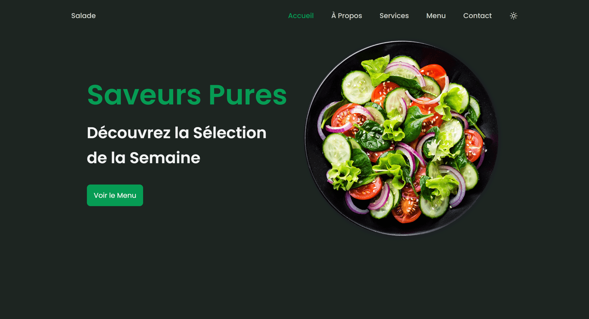

<div align="center">  
    <a href="https://salad-shop-vm.netlify.app/" target="_blank">  
        
    </a>
    </br>  
    </br>  
  <h3 align="center">🥗 Bol & Vitalité &nbsp; — &nbsp; Restaurant de Salades</h3>  
</div>

## <br /> 📌 Sommaire

&nbsp;&nbsp;&nbsp; 🎨 &nbsp; [**Introduction**](#introduction)<br />
&nbsp;&nbsp;&nbsp; 🛠️ &nbsp; [**Technologies**](#technologies)<br />
&nbsp;&nbsp;&nbsp; 🎯 &nbsp; [**Fonctionnalités**](#fonctionnalités)<br />
&nbsp;&nbsp;&nbsp; 🚀 &nbsp; [**Installation**](#installation)<br />

## <br /> <a name="introduction">🎨 Introduction</a>

Bol & Vitalité est une **landing page** moderne pour un restaurant de salades fraîches. Elle propose une navigation fluide et responsive, un menu dynamique, une application mobile, un mode sombre, des animations **ScrollReveal** et un design soigné.

## <br /> <a name="technologies">🛠️ Technologies</a>

- HTML5 sémantique et structuration claire
- CSS3 moderne avec variables, media queries et animations
- JavaScript ES6 clair et modulaire
- [ScrollReveal](https://scrollrevealjs.org/) pour des animations au scroll
- [Boxicons](https://boxicons.com/) pour des icônes vectorielles modernes
- Responsive Design pensé en mobile-first

## <br /> <a name="fonctionnalités">🎯 Fonctionnalités</a>

- Header fixe avec menu mobile et scroll actif
- Section Héro avec call-to-action clair
- Bloc À propos avec photo et bouton découverte
- Services listés avec pictogrammes
- Menu interactif de la semaine avec ajout au panier
- Section Application avec liens de téléchargement
- Bloc Contact simple et efficace avec CTA
- Scroll-to-top automatique au défilement
- Thème sombre activable
- Animations fluides avec ScrollReveal

## <br /> <a name="installation">🚀 Installation</a>

### ✅ Prérequis

- [Google Chrome](https://www.google.com/) &nbsp;—&nbsp; Navigateur moderne
- [Visual Studio Code](https://code.visualstudio.com/) &nbsp;—&nbsp; Éditeur de code
- [Live Server](https://marketplace.visualstudio.com/items?itemName=ritwickdey.LiveServer) &nbsp;—&nbsp; Extension VS Code

### 📥 Cloner le projet

```bash
git clone git@github.com:ValentinMadiot/salad-shop_ui
cd salad-shop_ui
```

### ▶️ Lancer le projet

Il suffit d’ouvrir le fichier `index.html` dans un navigateur, ou d’utiliser l’extension **Live Server** sur VS Code pour un aperçu dynamique.
